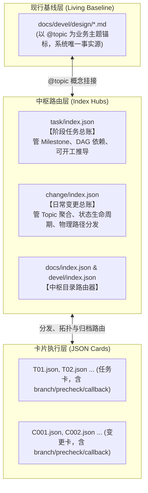

# ad-flow: Agentic Documentation Governance Flow

> **面向 AI 时代人机协作的结构化、解耦型“文档驱动开发”（Doc-Driven Engineering）治理框架与通用工程脚手架**

---

## 1. 简介 (Introduction)

在大型语言模型与自主代码 Agent 深度融入软件工程研发的当下，传统的“代码先行、事后补文档”或“纯线性敏捷任务池”开发模式在人机协同中迅速暴露出深层次的失控：
- **文档光速漂移**：代码频繁演进，设计文档与真实实现严重脱节，沦为“失真死文档”；
- **上下文污染与阻断**：缺少清晰的文档分层契约，Agent 检索时要么因信息过载撑爆 Context 窗口，要么因缺乏结构漏看核心业务约束；
- **路径强耦合导致断链**：任务卡与变更卡直接硬编码引用设计文档物理路径，一旦版本发版归档或目录重构，全库链接大面积失效；
- **部署施工与实机现实断层**：部署指南写的是静态默认端口与理想配置，实际机器运行常遇端口冲突、实例复用或参数变更，导致后续自动化测试与重新部署频频撞车甚至误删数据库。

`ad-flow`（Agentic Documentation Governance Flow）源自工业级人机协作实战提炼，是一套**以“现行基线真理、中枢路由解耦、双轨闭环流转、零沉淀待办、部署实机真理”为核心支柱的通用工程文档治理框架**。它通过极简的单一技能指令 `$ad-flow`，在目标项目中一键落地 21 个相互咬合、严密自洽的标准化工程治理脚手架。

---

## 2. 目标 (Goals)

`ad-flow` 致力于解决 AI 辅助研发中的“失真、漂移、耦合、失控”四大痛点，达成以下工程治理目标：

1. **确立现行基线真理源（Living Baseline）**：
   系统只有一套代表当下最新规则的现行设计基线（`docs/devel/design/`），不搞孤立的文档小版本号，以 `@topic` 概念锚点保持全文自洽，杜绝多版本混淆。
2. **实现执行卡片与物理路径彻底解耦（Decoupled Hubs）**：
   任务卡（`Txx`）与变更卡（`Cxxx`）绝不硬编码设计文档的相对路径，全量通过中枢总账（`index.json`）动态映射。历史版本封箱归档仅需调整总账指向，设计文档零修改、零断链。
3. **践行待办缓冲零沉淀纪律（Zero Sediment）**：
   零散缺陷、临时微调与远期技术债在待办池（`now.md` / `future.md`）中暂存。一旦立项建卡，**必须立即物理删除**，彻底消灭“已办事项长期堆积成文档垃圾”的慢性沉淀。
4. **统一施工蓝图与物理运行现实，双重隔离构建与运行（Deployment & Build Reality）**：
   部署指南（`docs/guide/`）是设计蓝图，实测报告（`local/deploy_report.md`）是物理运行现实。所有后续自动化测试、联调与重启必须以实机报告为唯一事实依据；同时将所有**编译构建打包产物（`local/dist/`、`local/bin/`）与运行时数据（`local/data/`、`local/logs/`）强制全量收拢在 `local/` 隔离区**中，严禁向源码树扩散。
5. **原生适配多分支并行研发（Multi-Branch Isolation）**：
   在任务卡与变更卡中原生注入执行分支标签（`branch`），总账实时索引，确保多分支、多人机并行开发时上下文清晰对齐。

---

## 3. 功能 (Features)

| 功能模块 | 说明 | 核心价值 |
|---|---|---|
| **极简单一指令调用** | 对话框输入 `$ad-flow` 即可激活治理落地 | 移除一切碎屑子命令，实现“意图即触发，对话即落地” |
| **版本感知与平滑升级引擎** | 目标 `AGENTS.md` 注入 `<!-- @ad-flow: initialized v1.1.0 -->`，重新调用 `$ad-flow` 自动感知 skill 版本并平滑升级协作宪法、README 矩阵与卡片模板 | 规则升级零手工，100% 保护存量业务设计与卡片数据 |
| **存量工程智能迁移与基线重构** | 自动勘察旧资产（`docs/` 先原子移入 `_adflow_backup/original_docs/docs/` 并清空重建，连同 `openspec/`、`superpower/` 等备份），深度研读旧文档与源码，自动重构为自洽的现行设计基线（`00-系统总体设计.md` + 模块化 `01~NN.md`）并在总账注册 | **存量规范 0 丢失**，杜绝原地同名污染，无缝升级至 ad-flow 统一标准体系 |
| **项目自定义规则融合引擎** | 自动提取目标工程已有 `Agent.md` 中的团队业务规约并无缝追加至新宪法 | 100% 继承团队既有开发习惯，不造成规则撕裂 |
| **21 文件全景标准化脚手架** | 自动生成涵盖文档中心、静态资源库、指引区、内场区、总账路由、双卡模板与归档库的全套资产 | 目录结构高度对齐，每个目录均配有专属 README 与机器索引 |
| **多分支执行标签原生感知** | 卡片与总账结构原生内嵌 `"branch": "feat/..."` / `"fix/..."` 属性 | 消除分支错乱，原生契合 Git 工作流 |
| **卡片预检与前后生命周期钩子** | 卡片内嵌 `precheck`（已完成性嗅探）与 `callback`（`before / after` 脚本钩子） | 防范重复无效劳动，原生支持环境预热、分支准备与质量门禁自动触发 |
| **构建打包与运行物理双隔离** | 编译构建产物（`local/dist/`、`local/bin/`）与实机报告（`local/deploy_report.md`）全量汇聚 `local/` | 根目录与源码树零污染，杜绝二进制意外入库，运行数据 100% 隔离 |
| **设计基线挂接严密防偷懒** | 机械硬判严禁将任何 `README.md` 作为 `design_doc` 关联（`INV_NO_README_AS_DESIGN_DOC`） | 杜绝 AI 把目录说明书当业务设计、强制遵循“文档先行”补全基线 |

---

## 4. 设计 (Architecture & Design)

### 4.1 中枢解耦三位一体模型 (Triad Decoupled Model)

`ad-flow` 的核心架构模型是 **“卡片执行层 $\longleftrightarrow$ 中枢路由层 $\longleftrightarrow$ 现行基线层”** 三位一体解耦模型：



- **基线与卡片脱钩**：卡片只需声明属于哪个 `@topic`，无需关心设计文档叫什么文件名、在哪个目录；
- **版本封箱只读归档**：发版打 Tag 时，整批卡片移动到 `docs/archive/<version>/`，只需在 `index.json` 更新物理路径，设计文档保持 0 改动、0 断链。

---

### 4.2 双轨事项流转总线 (Dual-Track Bus)

系统研发事项严格划分为两大流转通道，各司其职：

```text
【待办登记】  缺陷 / 微调 / 突发 ──► docs/devel/todo/now.md 登记
           远期特性 / 技术债   ──► docs/devel/todo/future.md 登记
                  （落地建卡即移出 · 零沉淀 · 编号全局自增）

【通道 A：变更修复流 (BugFix Track)】 
  now.md 登记 ──► change/ 建 Cxxx.json (声明 branch/precheck/callback) ★ 建卡即从 todo 物理移出
        └─► 声明 target.topic 与 rule_diff (修改前规则 vs 修改后规则)
             └─► 执行 precheck 嗅探已修复性 ──► 执行 callback.before 准备环境
                  └─► 切分支编码 + 补回归测试 ──► 执行 callback.after 质量门禁
                       └─► 采集 evidence + run_id，人机对齐代签 (verified)
                            └─► 合入主干 ──► 回写 design + CHANGELOG + index.json 闭环

【通道 B：阶段任务流 (Feature Track)】
  future.md 登记 ──► design/ 撰写或修订现行设计方案 (@topic)
        └─► task/ 拆解 Txx.json (声明 branch/precheck/callback) + 注册 task/index.json
             └─► 按 depends_on DAG 拓扑顺序推进
                  └─► 执行 precheck 嗅探已完成性 ──► 执行 callback.before 准备环境
                       └─► 纯函数/服务实现 + 单测 ──► 执行 callback.after 收尾校验
                            └─► DoD 验收全绿 ──► 阶段封箱归档至 archive/<version>/
```

---

### 4.3 初始化产物目录骨架全景 (21 个标准化基线文件)

执行 `$ad-flow` 初始化后，目标工程将严密生成以下 21 个治理基础文件及运行时隔离区：

```text
<目标工程根目录>/
├── AGENTS.md                         # 【1/21 项目协作宪法】含 <!-- @ad-flow: initialized v1.1.0 --> 标签与 8 大规范
├── CHANGELOG.md                      # 【2/21 版本更新日志】SemVer 规范，[Unreleased] 挂接变更与任务卡
│
├── local/                            # 【本地隔离运行与产物区】（已加入 .gitignore，AI 严禁删除）
│   ├── dist/                         # 打包与编译产物输出目录（所有构建包一律强制收拢于此）
│   ├── build/                        # 构建临时与中间产物目录
│   ├── data/                         # 本地数据库与持久化数据存储目录
│   ├── logs/                         # 本地运行时与调试日志输出目录
│   └── deploy_report.md              # 【实机部署报告】记录实际端口、DB路径、PID、端点（测试与重部署唯一依据）
│
├── docs/                             # 【工程文档中心】
│   ├── README.md                     # 【3/21 文档中心总览】统一四章结构（简介/索引/规范/发版）+ 英文元数据
│   ├── index.json                    # 【4/21 顶层机器路由】全景目录路由中枢（记录工程元数据与 adflow_version）
│   │
│   ├── assets/                       # 【文档与工程静态资源库】统一收拢架构图、App 截图、视觉素材
│   │   └── README.md                 # 【5/21 资源库索引与规范】命名契约、体积限制与引用格式
│   │
│   ├── guide/                        # 【操作指引区】标准操作手册（部署、运维、联调）
│   │   ├── README.md                 # 【6/21 指南目录索引】指南编写四要素与实机部署事实依据原则
│   │   ├── index.json                # 【7/21 指南机器索引】操作指南结构化清单与产物映射
│   │   └── 01-本地部署指南.md        # 【8/21 本地部署指南】标准本地环境搭建与服务启动手册（施工蓝图）
│   │
│   ├── devel/                        # 【开发核心区】研发内场作战室
│   │   ├── README.md                 # 【9/21 开发者主索引】内场四层架构与双轨事项流转总线
│   │   ├── index.json                # 【10/21 内场机器路由】研发内场子系统总账中枢
│   │   │
│   │   ├── design/                   # 【现行设计基线】系统唯一真理（@topic 锚点）
│   │   │   └── README.md             # 【11/21 设计基线大纲】内嵌 8 节标准设计方案大纲（严禁伪造虚假设计）
│   │   │
│   │   ├── change/                   # 【变更核验卡池】日常 Bug 修复与微调
│   │   │   ├── README.md             # 【12/21 变更核验指南】抗漂移原理、前后对比表要求与核验代签
│   │   │   ├── index.json            # 【13/21 变更总账中枢】Topic 映射、状态追踪与分支路由
│   │   │   └── template.json         # 【14/21 变更卡模板】标准 C 卡模板（含 branch 分支标签）
│   │   │
│   │   ├── task/                     # 【阶段研发任务】Phase/Milestone 交付流
│   │   │   ├── README.md             # 【15/21 任务研发指南】DAG 拓扑算法、能力交付与完成定义 (DoD)
│   │   │   ├── index.json            # 【16/21 任务总账中枢】Milestone 汇聚、拓扑依赖与分支路由
│   │   │   └── template.json         # 【17/21 任务卡模板】标准 T 卡模板（含 branch 分支标签）
│   │   │
│   │   └── todo/                     # 【待办缓冲池】零沉淀事项池
│   │       ├── README.md             # 【18/21 待办缓冲指南】落地建卡即物理删除的零沉淀纪律
│   │       ├── now.md                # 【19/21 缺陷待办缓冲】当前缺陷、回调与微调暂存表
│   │       └── future.md             # 【20/21 特性待办缓冲】远期特性与技术债暂存表
│   │
│   └── archive/                      # 【历史归档区】版本发版打 Tag 后整体封存（只读冻结）
│       └── README.md                 # 【21/21 历史归档索引】发版封箱四步 SOP 与只读规则
│
└── _adflow_backup/                   # 【安全备份区】仅进行中项目接入时生成（AI 严禁删除，仅人类核验后清理）
    ├── README.md                     # 备份安全声明
    └── original_docs/                # 原有文档完整备份（原子移走旧 docs/、openspec/、superpower/、specs/ 及根目录 md）
```

---

### 4.4 状态机流水线设计 (workflow.yaml)

治理落地过程由确定性状态机 [workflow.yaml](workflow.yaml) 驱动，包含 **5 大机器硬性约束** 与 **7 步流水线**：

- **硬性约束 (Invariants)**：
  1. `INV_VERSION_AWARE_UPGRADE_GUARD`：`AGENTS.md` 包含 `<!-- @ad-flow: initialized vX.Y.Z -->` 时，版本一致时安全退出；版本陈旧时自动进入平滑升级流程；
  2. `INV_NO_AGENT_DELETE_BACKUP`：AI Agent 严禁擅自删除或篡改 `_adflow_backup/`；
  3. `INV_NO_AGENT_DELETE_LOCAL`：AI Agent 严禁擅自删除或重置 `local/` 及其部署报告；
  4. `INV_EVIDENCE_BASED_DESIGN`：严禁生成空洞的占位符假设计文档；若存在旧文档或源码，**必须研读并重构为现行基线设计方案**；
  5. `INV_BASE_GOVERNANCE_COUNT`：必须精确产出至少 21 个标准化基础治理文件，并在存在旧资产时输出 N 篇重构的现行基线设计文档。
- **流水线步骤 (Pipeline)**：
  - **初次初始化流**：`Step 1: 资产勘察与版本检测` $\rightarrow$ `Step 2: 人工确认守卫` $\rightarrow$ `Step 3: docs/ 原子移走与安全快照` $\rightarrow$ `Step 4: AGENTS.md 宪法融合 (v1.1.0)` $\rightarrow$ `Step 5: 9大目录独立 README 矩阵` $\rightarrow$ `Step 6: 中枢总账与模板注入` $\rightarrow$ **`Step 7: 旧文档消化与设计基线重构 (Legacy Synthesis)`** $\rightarrow$ `Step 8: DoD 完整性硬断言与交付汇报`。
  - **版本升级流 (Upgrade Pipeline)**：检测到旧版本时自动执行 `U1 备份快照` $\rightarrow$ `U2 宪法同步(100%保留自定义规则)` $\rightarrow$ `U3 9大 README 规范同步` $\rightarrow$ `U4 卡片模板同步(不碰业务卡片)` $\rightarrow$ `U5 配置版本号提升` $\rightarrow$ `U6 升级汇报`。

---

## 5. 本地构建打包、部署与环境隔离规约 (Build, Deployment & Local Isolation)

`ad-flow` 深度贯彻 **“构建打包全量隔离，施工蓝图与物理运行实况解耦”** 的治理哲学：

### 1. 构建与打包产物全量收拢至 `local/`（绝对红线）
- **构建成果物隔离输出**：所有编译、构建、打包、分发产物（包括但不限于前端 bundle `local/dist/`、后端可执行程序 `local/bin/`、Python wheel/sdist、Java jar/war、容器导出镜像、静态资源构建包及编译临时中间件 `local/build/`），**一律强制输出至项目根目录的 `local/` 目录中**；
- **源码树纯净度 100% 保护**：严禁在项目根目录或源码树中散落生成未受 `.gitignore` 保护的打包产物；杜绝大体积二进制或构建缓存意外入库；
- **工具链适配规约**：若工具链默认输出到根目录（如 Vite/Webpack 默认 `./dist`、Go 默认当前目录、Python 默认 `./dist`），必须在构建命令传参指定输出路径（如 `--outDir local/dist`、`-o local/bin/app`、`--outdir local/dist`）或通过构建脚本自动重定向收拢到 `local/`。

### 2. 施工蓝图 vs 实机运行现实
- **标准施工方案 (`docs/guide/01-本地部署指南.md`)**：
  定义系统技术栈版本、环境变量全表（`.env`）、前后端标准启动命令、健康检查端点及卸载清理步骤（静态标准）；
- **物理运行实况 (`local/deploy_report.md`)**：
  真实部署完成后，开发者或 Agent 必须在 `local/` 产出实况报告，记录本次实际分配的监听端口、实际数据库路径、实时进程 PID、日志路径以及健康检查回执（动态现实）。

### 3. 测试与重新部署的“唯一事实依据”
- **绝对红线**：**后续所有自动化测试、集成验证、日常重启与重新部署，必须严格以 `local/deploy_report.md` 中的实时数据为准**；
- **严禁抛开报告重新翻阅部署指南**猜测端口或执行可能清空数据的初始化命令；
- 若配置变更或服务重启，必须即时同步更新 `local/deploy_report.md`。

### 4. 运行时隔离与仅人类清理红线
- 部署与测试运行时产生的所有临时文件、数据库（SQLite / DuckDB 等）、缓存及日志，**一律强制收拢于 `local/` 目录**（如 `local/data/`、`local/logs/`），严禁向源码树扩散；
- **【严格红线】`local/` 仅人类手工清理**：**AI Agent 严禁擅自删除或重置 `local/` 目录**，所有打包产物、本地数据库、实测报告与调试数据的生命周期 100% 由人类在宿主机终端手动维护。

---

## 6. 快速开始 (Quick Start)

### 6.1 调用方式

在任意支持 Agent 的对话框中，直接键入 `$ad-flow`：

```text
$ad-flow                  # 在当前项目工作区执行规范落地初始化
$ad-flow /path/to/project # 在指定工程根目录执行规范落地初始化
$ad-flow --yes            # 免确认快速执行初始化（适合空项目或脚本化场景）
```

### 6.2 初始化交互流程

1. **防重入阻断**：若当前工程已存在 `AGENTS.md` 且包含 `<!-- @ad-flow: initialized -->`，Agent 会立即报告已处于治理状态并安全退出；
2. **存量确认**：若项目已包含源码或文档，Agent 会主动向人类发起确认提示：
   > “检测到当前项目处于【进行中】（已存在代码/文档资产）。接入 ad-flow 前将自动为您在 `_adflow_backup/` 完整备份现有资产。是否确认初始化？[y/N]”
3. **安全注入与脚手架**：确认后自动备份原有文档，提取并保留旧版自定义规约，生成 21 个标准化文件；
4. **终验报告**：Agent 校验 21 个文件全部就绪后，呈报核心导航入口（`AGENTS.md`、`docs/README.md`、`docs/devel/design/README.md`、`docs/guide/01-本地部署指南.md`）。

---

## 7. 技能包资产清单 (Repository Layout)

```text
skills/ad-flow/
├── SKILL.md                          # Skill 调度大脑（面向 Agent 的纯英文状态机指令规范）
├── workflow.yaml                     # 初始化流水线状态机（定义 21 文件断言与不可变约束）
├── README.md                         # 本说明文档（面向工程团队的架构与使用指引）
│
├── templates/                        # 标准脚手架资产库（供 init 一键注入）
│   ├── AGENTS.md.tpl                 # 项目宪法模板（含防重入标签、多分支提交规约与部署红线）
│   └── docs/
│       ├── README.md.tpl             # 顶层文档中心规范（统一四章结构 + 英文元数据）
│       ├── index.json.tpl            # docs/ 顶层机器路由清单
│       ├── devel-README.md.tpl       # docs/devel 索引导航与双轨总线（统一四章结构）
│       ├── devel-index.json.tpl      # docs/devel 机器总账路由清单
│       ├── changelog.md.tpl          # 双向互链 CHANGELOG 模板
│       ├── design/README.md.tpl      # 活设计基线模板 (内嵌 8 节标准大纲)
│       ├── change/                   # 变更卡与总账模板 (含 README.md, index.json, change-card)
│       ├── task/                     # 任务卡与总账模板 (含 README.md, index.json, task-card)
│       ├── todo/                     # 零沉淀待办缓冲池模板 (含 README.md, now.md, future.md)
│       ├── guide/                    # 本地部署与运行指南 (含 README.md, index.json, 01-部署指南)
│       └── archive-README.md.tpl     # 发版封箱归档 SOP
│
├── references/                       # 渐进披露手册（Agent 按需查阅）
│   ├── 01-mental-model.md            # 治理心智：活基线、零沉淀、中枢解耦
│   ├── 02-change-sop.md              # 变更流标准操作规程（含 branch 分支流转）
│   ├── 03-task-sop.md                # 任务研发流操作规程（含 branch 分支流转）
│   ├── 04-index-routing.md           # 索引总账与路由规约
│   ├── 05-audit-checklist.md         # 对抗式合规审计清单
│   ├── 06-exception-and-hotfix.md    # 驳回回流、Hotfix 与防撞号
│   └── 07-release-archive-sop.md     # 发版与阶段封箱归档 SOP
│
└── examples/                         # 工业级真实脱敏样本库
    ├── sample-change-card.json       # 变更卡真实范例 (含 branch 标签)
    ├── sample-task-card.json         # 任务卡真实范例 (含 branch 标签)
    ├── sample-change-index.json      # 变更总账真实范例
    ├── sample-task-index.json        # 任务总账真实范例
    └── sample-design-doc.md          # 现行设计文档真实范例
```
