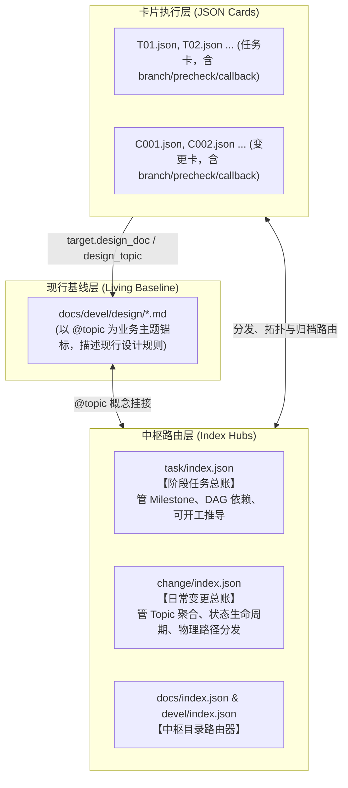

# ad-flow: Agentic Documentation Governance Flow

面向 AI Agent 与开发者的文档驱动开发治理技能：在项目中安装设计基线、双轨卡片、索引、操作规范和流程校验器。

当前治理规范版本：**1.2.0**。发布情况见 [CHANGELOG](CHANGELOG.md)。

**首次调用完成初始化；日常直接提出开发需求；希望同步新版规范时才再次调用。** 项目内的规则、模板和校验器可独立使用，更新技能包不会后台修改已有项目。

快速导航：[首次初始化](#61-首次初始化) · [日常开发](#62-一次初始化后的日常使用) · [按需升级](#63-按需升级) · [校验命令](#64-在项目终端运行校验)

---

## 1. 简介 (Introduction)

`ad-flow` 用现行设计基线描述业务规则，以任务卡（T）推进阶段能力，以变更卡（C）记录缺陷修复和规则差异。索引管理卡片路径与状态，待办池只暂存尚未建卡的事项，部署报告记录实际运行情况。

初始化和升级由 Agent 按 [SKILL.md](SKILL.md) 与 [workflow.yaml](workflow.yaml) 执行；目标项目获得 **23 个治理文件（含 10 个目录 README）及 2 个校验器文件**。已有源码或文档的项目还需依据真实来源重构设计基线，不能把示例登记成项目事实。

首次使用时，让 Agent 能发现本技能，并在目标项目对话中输入 `$ad-flow`。校验器需要 Python 3，使用标准库；`scripts/adflow-verify` 是调用 Python 的 Shell 入口。技能调用写在对话中，校验命令在项目终端执行。

---

## 2. 目标 (Goals)

核心目标是让设计、执行记录、代码证据与运行事实保持可追溯：

1. **确立现行基线真理源（Living Baseline）**：
   系统只有一套代表当下最新规则的现行设计基线（`docs/devel/design/`），不搞孤立的文档小版本号，以 `@topic` 概念锚点保持全文自洽，杜绝多版本混淆。
2. **集中管理卡片路由（Index Hubs）**：
   任务卡（`Txx`）与变更卡（`Cxxx`）以 `target.design_doc` 和 `target.design_topic` 明确挂接设计基线；中枢总账（`index.json`）负责卡片的物理路径映射。历史版本封箱归档仅需调整总账指向，设计文档零修改、零断链。
3. **践行待办缓冲零沉淀纪律（Zero Sediment）**：
   零散缺陷、临时微调与远期技术债在待办池（`now.md` / `future.md`）中暂存。一旦立项建卡，**必须立即物理删除**，彻底消灭“已办事项长期堆积成文档垃圾”的慢性沉淀。
4. **统一施工蓝图与物理运行现实，双重隔离构建与运行（Deployment & Build Reality）**：
   部署指南（`docs/guide/`）是设计蓝图，实测报告（`local/deploy_report.md`）是物理运行现实。涉及已有实例的测试、联调与重启优先参考实机报告，并用当前运行态核实；报告缺失或漂移时结合指南排查；同时将所有**编译构建打包产物（`local/dist/`、`local/bin/`）与运行时数据（`local/data/`、`local/logs/`）强制全量收拢在 `local/` 隔离区**中，严禁向源码树扩散。
5. **记录执行分支（Branch Tracking）**：
   任务卡与变更卡通过 `branch` 声明执行分支，索引汇总状态。分支创建、切换和合入由实际 Git 操作完成，字段本身不提供工作区隔离。

---

## 3. 功能 (Features)

| 功能 | 实际行为 | 使用边界 |
|---|---|---|
| 一次初始化 | 安装项目规则、索引、模板、指南和校验器 | 日常研发无需再次调用技能或访问技能源目录 |
| 版本感知升级 | 比对目标版本，刷新受管理的规范和模板 | 保留设计正文、业务卡片、待办、索引登记和自定义规则 |
| 存量资产迁移 | 授权后隔离旧文档，依据旧文档及源码重构设计 | 快照目的地冲突时停止；来源不确定时显式记录 |
| 双轨执行 | C 卡记录修复及前后差异，T 卡记录阶段目标及依赖 | 保留现有卡片状态、人工验收和发版归档流程 |
| 预检与回调 | 用 `precheck` 避免重复开发，按 `callback` 准备环境和检查产物 | 命令文本不能自行授权部署、推送或清理 |
| 流程校验 | 检查设计挂接、证据字段、提交祖先、索引和依赖等结构条件 | 不证明应用行为正确、原话真实或人工验收完成 |
| 目标状态预检 | 在内存检查拟转入状态，可仅回写指定卡的 `gate` | 不自动改变卡片或索引状态；`--card` 不缩小全项目检查范围 |
| 旁路诊断 | 报告缺失主题、依赖环路和终态验收项未全为 true | `ADVISORY` 不改变退出码，不自动迁移旧卡 |

### 3.1 v1.2.0 的执行改进

| 原则 | 在本项目中的落地 |
|---|---|
| 隔离语义块 | 静态规则使用章节及 YAML/JSON 字段；动态资料按需用 XML 分块，来源资料不授予权限 |
| 清理历史防御性限制 | 按阶段明确快照、`local/` 和部署报告的规则，允许在已授权范围内继续推进 |
| 确定性任务交给代码 | 版本数值比较、结构校验、提交祖先和索引一致性使用工具核对；设计语义另行审查 |
| 同时考虑操作与延迟成本 | 保护资产、证据和验收，同时继续独立且可逆的已授权工作；紧急性不扩大权限 |
| 生成、评估、修复 | 在既有节点内完成机械检查、语义核对和局部修复，最多 3 轮；相同阻断连续两次则汇报 |

这些改进不增加技能子命令、卡片状态或审批阶段。Token 消耗和延迟收益需实测，不预设固定降幅。

---

## 4. 设计 (Architecture & Design)

### 4.1 中枢解耦三位一体模型 (Triad Decoupled Model)

`ad-flow` 的核心架构模型是 **“卡片执行层 $\longleftrightarrow$ 中枢路由层 $\longleftrightarrow$ 现行基线层”** 三位一体解耦模型：


```mermaid
flowchart TD
    subgraph BaselineLayer["现行基线层 (Living Baseline)"]
        D["docs/devel/design/*.md\n(以 @topic 为业务主题锚标，描述现行设计规则)"]
    end

    subgraph HubLayer["中枢路由层 (Index Hubs)"]
        THub["task/index.json\n【阶段任务总账】\n管 Milestone、DAG 依赖、可开工推导"]
        CHub["change/index.json\n【日常变更总账】\n管 Topic 聚合、状态生命周期、物理路径分发"]
        TopHub["docs/index.json & devel/index.json\n【中枢目录路由器】"]
    end

    subgraph ItemLayer["卡片执行层 (JSON Cards)"]
        TCards["T01.json, T02.json ... (任务卡，含 branch/precheck/callback)"]
        CCards["C001.json, C002.json ... (变更卡，含 branch/precheck/callback)"]
    end

    D <-->|"@topic 概念挂接"| HubLayer
    HubLayer <-->|"分发、拓扑与归档路由"| ItemLayer
    ItemLayer -->|"target.design_doc / design_topic"| D
```

- **基线与卡片脱钩**：卡片明确挂接设计文档及其 `@topic`，源码影响范围用领域能力描述；卡片归档路径由索引管理；
- **设计挂接**：`target.design_doc` 指向真实设计正文，正文包含与 `target.design_topic` 匹配的 `<!-- @topic: TopicName -->`；目录 `README.md` 不能代替设计文档；
- **版本封箱只读归档**：发版打 Tag 时，整批卡片移动到 `docs/archive/<version>/`，只需在 `index.json` 更新物理路径，设计文档保持 0 改动、0 断链。

---

### 4.2 双轨事项流转总线 (Dual-Track Bus)

系统研发事项严格划分为两大流转通道，各司其职：

```text
【待办登记】  缺陷 / 微调 / 突发 ──► docs/devel/todo/now.md 登记
           远期特性 / 技术债   ──► docs/devel/todo/future.md 登记
                  （落地建卡即移出 · 零沉淀 · 编号全局自增）

【通道 A：变更修复流 (BugFix Track)】 
  now.md 登记 ──► change/ 建 Cxxx.json (声明 branch/precheck/callback) ★ 建卡即从 todo 物理移出
        └─► 声明 target.design_doc / design_topic 与 design.rule_diff
             └─► 执行 precheck 嗅探已修复性 ──► 执行 callback.before 准备环境
                  └─► 切分支编码 + 补回归测试 ──► 执行 callback.after 质量门禁
                       └─► 采集证据及真实人工确认 ──► 预检 verified ──► 同步状态
                            └─► 授权合入、回写基线与日志 ──► 预检 closed ──► 同步状态

【通道 B：阶段任务流 (Feature Track)】
  future.md 登记 ──► design/ 撰写或修订现行设计方案 (@topic)
        └─► task/ 拆解 Txx.json (声明 branch/precheck/callback) + 注册 task/index.json
             └─► 按 depends_on DAG 拓扑顺序推进
                  └─► 执行 precheck 嗅探已完成性 ──► 执行 callback.before 准备环境
                       └─► 纯函数/服务实现 + 单测 ──► 执行 callback.after 收尾校验
                            └─► DoD 验收全绿 ──► 预检 completed ──► 同步状态
                                 └─► 阶段封箱归档至 archive/<version>/
```

---

### 4.3 初始化产物目录骨架全景 (23 个治理文件 + 2 个校验器文件)

执行 `$ad-flow` 初始化后，生成下列 23 个治理文件及 2 个校验器文件。`local/` 由后续授权构建/部署使用，初始化不触碰既有运行内容：

```text
<目标工程根目录>/
├── AGENTS.md                         # 【1/23 项目协作宪法】含 <!-- @ad-flow: initialized v1.2.0 --> 标签与 8 大规范
├── CHANGELOG.md                      # 【2/23 版本更新日志】SemVer 规范，[Unreleased] 挂接变更与任务卡
│
├── local/                            # 【本地隔离运行与产物区】（应加入 .gitignore，AI 严禁擅自删除）
│   ├── dist/                         # 打包与编译产物输出目录（所有构建包一律强制收拢于此）
│   ├── build/                        # 构建临时与中间产物目录
│   ├── data/                         # 本地数据库与持久化数据存储目录
│   ├── logs/                         # 本地运行时与调试日志输出目录
│   └── deploy_report.md              # 【实机部署报告】记录实际端口、DB路径、PID、端点（涉及实例时核对当前运行态）
│
├── docs/                             # 【工程文档中心】
│   ├── README.md                     # 【3/23 文档中心总览】统一四章结构（简介/索引/规范/发版）+ 英文元数据
│   ├── index.json                    # 【4/23 顶层机器路由】全景目录路由中枢（记录工程元数据与 adflow_version）
│   │
│   ├── assets/                       # 【文档与工程静态资源库】统一收拢架构图、App 截图、视觉素材
│   │   └── README.md                 # 【5/23 资源库索引与规范】命名契约、体积限制与引用格式
│   │
│   ├── guide/                        # 【操作指引区】标准操作手册（部署、运维、联调）
│   │   ├── README.md                 # 【6/23 指南目录索引】指南编写四要素与实机部署事实依据原则
│   │   ├── index.json                # 【7/23 指南机器索引】操作指南结构化清单与产物映射
│   │   └── 01-本地部署指南.md        # 【8/23 本地部署指南】标准本地环境搭建与服务启动手册（施工蓝图）
│   │
│   ├── devel/                        # 【开发核心区】研发内场作战室
│   │   ├── README.md                 # 【9/23 开发者主索引】内场五层架构与双轨事项流转总线
│   │   ├── index.json                # 【10/23 内场机器路由】研发内场子系统总账中枢
│   │   │
│   │   ├── design/                   # 【现行设计基线】系统唯一真理（@topic 锚点）
│   │   │   └── README.md             # 【11/23 设计基线大纲】内嵌 8 节标准设计方案大纲（严禁伪造虚假设计）
│   │   │
│   │   ├── change/                   # 【变更核验卡池】日常 Bug 修复与微调
│   │   │   ├── README.md             # 【12/23 变更核验指南】抗漂移原理、前后对比表要求与核验代签
│   │   │   ├── index.json            # 【13/23 变更总账中枢】Topic 映射、状态追踪与分支路由
│   │   │   └── template.json         # 【14/23 变更卡模板】标准 C 卡模板（含 branch 分支标签）
│   │   │
│   │   ├── task/                     # 【阶段研发任务】Phase/Milestone 交付流
│   │   │   ├── README.md             # 【15/23 任务研发指南】DAG 拓扑算法、能力交付与完成定义 (DoD)
│   │   │   ├── index.json            # 【16/23 任务总账中枢】Milestone 汇聚、拓扑依赖与分支路由
│   │   │   └── template.json         # 【17/23 任务卡模板】标准 T 卡模板（含 branch 分支标签）
│   │   │
│   │   ├── todo/                     # 【待办缓冲池】零沉淀事项池
│   │   │   ├── README.md             # 【18/23 待办缓冲指南】落地建卡即物理删除的零沉淀纪律
│   │   │   ├── now.md                # 【19/23 缺陷待办缓冲】当前缺陷、回调与微调暂存表
│   │   │   └── future.md             # 【20/23 特性待办缓冲】远期特性与技术债暂存表
│   │   │
│   │   └── env/                      # 【环境治理】开发环境配置、缓存盘点与安全清理
│   │       ├── README.md             # 【21/23 环境治理索引】环境规范与常用分级清理命令速查
│   │       └── 01-环境缓存与依赖清理指南.md # 【22/23 缓存与依赖清理指南】磁盘盘点、分级清理场景与快速重建 SOP
│   │
│   └── archive/                      # 【历史归档区】版本封箱后只读
│       └── README.md                 # 【23/23 历史归档索引】
│
├── scripts/
│   ├── adflow_verify.py              # 标准库校验器（不计入 23 个治理文件）
│   └── adflow-verify                 # 可执行入口
│
└── _adflow_backup/                   # 【安全备份区】存量初始化或升级时生成；已捕获快照只读
    ├── README.md                     # 备份安全声明
    ├── original_docs/                # 原有文档备份；根文档及 Agent 规则保存在 root_markdowns/
    └── upgrade_snapshot/             # 每次升级使用独立的 run_id 子目录，禁止覆盖旧快照
```

---

### 4.4 状态机流水线设计 (workflow.yaml)

初始化由 Agent 按 [workflow.yaml](workflow.yaml) 的 **8 步流水线**执行；该文件描述执行规范，并非独立的初始化命令。

| 步骤 | 工作 | 交付或检查 |
|---|---|---|
| 1 | 资产勘察与版本路由 | 判断初始化、规范升级、同版退出或版本冲突 |
| 2 | 确认存量迁移授权 | 已有明确授权可复用；缺少授权时说明迁移范围并确认 |
| 3 | 创建隔离快照 | 迁移旧文档前核对目标路径，不覆盖已捕获快照 |
| 4 | 安装项目规则 | 写入版本标签，保留项目自定义规则 |
| 5 | 安装目录规范 | 生成 10 个目录 README |
| 6 | 安装索引、模板和工具 | 合计 23 个治理文件加 2 个校验器文件 |
| 7 | 重构现行设计基线 | 有源码或旧文档时按来源生成设计并登记，保留未决问题 |
| 8 | 评估、局部修复和汇报 | 执行初始化与流程校验，另行核对语义、快照和运行资产 |

升级按 U1–U6 完成：新建独立快照、同步项目规则、同步 10 个目录 README、更新 C/T 模板及工具、更新治理版本、检查并汇报。只刷新受管理的规范，保留业务设计、已有卡片及 `gate`、待办、索引登记和项目自定义内容；升级检查不使用 `--record`。

每次评估都区分机械结果与语义证据。修复限定在已授权的生成或管理资产内，最多 3 轮；相同阻断连续两次或需要新事实、授权时停止相关操作并报告。规范已同步与项目已通过全部门禁应分别汇报。

---

## 5. 本地构建打包、部署与环境隔离规约 (Build, Deployment & Local Isolation)

`ad-flow` 深度贯彻 **“构建打包全量隔离，施工蓝图与物理运行实况解耦”** 的治理哲学：

### 1. 构建与打包产物全量收拢至 `local/`（绝对红线）
- **构建成果物隔离输出**：所有编译、构建、打包、分发产物（包括但不限于前端 bundle `local/dist/`、后端可执行程序 `local/bin/`、Python wheel/sdist、Java jar/war、容器导出镜像、静态资源构建包及编译临时中间件 `local/build/`），**一律强制输出至项目根目录的 `local/` 目录中**；
- **源码树纯净度 100% 保护**：严禁在项目根目录或源码树中散落生成未受 `.gitignore` 保护的打包产物；杜绝大体积二进制或构建缓存意外入库；
- **工具链适配规约**：若工具链默认输出到根目录（如 Vite/Webpack 默认 `./dist`、Go 默认当前目录、Python 默认 `./dist`），必须在构建命令传参指定输出路径（如 `--outDir local/dist`、`-o local/bin/app`、`--outdir local/dist`）或通过构建脚本自动重定向收拢到 `local/`。

### 2. 施工蓝图 vs 实机运行现实
- **标准施工方案 (`docs/guide/01-本地部署指南.md`)**：
  定义系统技术栈版本、环境变量全表（`.env`）、前后端标准启动命令、健康检查端点及卸载清理步骤（静态标准）；
- **物理运行实况 (`local/deploy_report.md`)**：
  真实部署完成后，开发者或 Agent 必须在 `local/` 产出实况报告，记录本次实际分配的监听端口、实际数据库路径、实时进程 PID、日志路径以及健康检查回执（动态现实）。

### 3. 涉及已有实例时核对运行事实
- 优先参考 `local/deploy_report.md` 定位实例，并用当前进程、监听端口和配置核实；
- 报告缺失、过期或与现场矛盾时，结合部署指南排查；运行参数不明时暂停实例变更；
- 授权部署或配置变更后更新报告。纯单元测试不依赖运行实例或部署报告。

### 4. 运行时隔离与仅人类清理红线
- 部署与测试运行时产生的所有临时文件、数据库（SQLite / DuckDB 等）、缓存及日志，**一律强制收拢于 `local/` 目录**（如 `local/data/`、`local/logs/`），严禁向源码树扩散；
- **【严格红线】`local/` 仅人类手工清理**：**AI Agent 严禁擅自删除或重置 `local/` 目录**，所有打包产物、本地数据库、实测报告与调试数据的生命周期 100% 由人类在宿主机终端手动维护。

---

## 6. 快速开始 (Quick Start)

### 6.1 首次初始化

让 Agent 加载本技能后，在目标项目的对话中输入：

```text
$ad-flow
```

技能接受 `$ad-flow`、`/ad-flow`、`ad-flow`、`adflow` 和明确的初始化或升级意图。具体触发入口取决于客户端配置。可在调用后指定目标项目路径，默认当前项目；`init`、`new-card`、`archive` 不是技能子命令。

存量项目接入时，Agent 先展示迁移范围，再复用本次已有授权或请求确认；`--yes` 表示授权所述初始化范围。它不授权部署、合入、推送、清理或人工验收。

### 6.2 一次初始化后的日常使用

首次初始化后，直接提出功能或缺陷需求，Agent 使用项目内的 `AGENTS.md`、目录 README、模板、索引和校验器执行既有双轨流程。无需再次调用 `$ad-flow`，也无需访问技能源目录。希望同步新版规范时才再次调用；更新技能包不会后台更新已有项目。

例如，初始化后的日常对话可以直接写：

```text
修复登录失败时缺少错误提示的问题，按本项目规范完成变更与验证。
```

日常从目标项目的 `docs/devel/change/template.json` 或 `docs/devel/task/template.json` 建卡，按其目录 README 推进。C 卡保留人工确认、核验、合入及闭环；T 卡保留依赖推进、DoD 和归档。具体语义见 [变更 SOP](references/02-change-sop.md) 与 [任务 SOP](references/03-task-sop.md)；这些手册供查阅，日常必需规则已落在目标项目内。

### 6.3 按需升级

先更新技能包，再在需要同步规范的目标项目对话中调用：

```text
$ad-flow --upgrade
```

| 目标版本状态 | 本次行为 |
|---|---|
| 无 ad-flow 标签且无版本记录 | 勘察后执行首次初始化 |
| 低于 1.2.0，或已有无版本的初始化标签 | 进入保留业务资产的升级流 |
| 等于 1.2.0 | 默认零修改退出；显式 `--upgrade` 或 `--force` 才同步规范 |
| 高于 1.2.0 | 不降级，含 `--force` 情况 |
| 版本来源冲突或格式无效 | 报告冲突，不写入 |

版本使用代码按数值分段比较。升级保留现有业务记录，不批量迁移旧卡，不把新增 `ADVISORY` 追溯升级为硬门槛。

### 6.4 在项目终端运行校验

以下命令在**已经初始化的目标项目根目录**执行。默认只读，可选的第一个位置参数指定其他目标目录。

```bash
# 骨架检查：23 个治理文件、禁用占位设计和初始化标签
scripts/adflow-verify --mode init --json

# 流程检查：按所有活跃卡的状态核对已覆盖前提
scripts/adflow-verify --json
```

也可直接运行 Python 入口：

```bash
python3 scripts/adflow_verify.py --json
```

下例假设项目中已有 `C001` 和 `T01`，使用时选择本次实际卡号与目标状态。仅预检，不回写：

```bash
scripts/adflow-verify --card C001 --to verified --json
```

完成真实测试和所需人工验收后，按本次目标选择一条命令，将真实校验结果记录到指定卡的 `gate`：

```bash
# C 卡：已记录真实 user_quote/signoff，预检 verified
scripts/adflow-verify --card C001 --to verified --record

# C 卡：已回填真实 sync.commit、基线与 CHANGELOG，预检 closed
scripts/adflow-verify --card C001 --to closed --record

# T 卡：已满足 DoD、完成前置依赖并回填 sync.commit，预检 completed
scripts/adflow-verify --card T01 --to completed --record
```

**预检不改变卡片或索引状态。** Exit 0 后，由执行者同步该卡及索引状态，再运行普通 `scripts/adflow-verify` 复核。`--card` 仅限定回写及目标状态预检，所有活跃卡与全局问题仍参与检查；因此全局或其他卡的违规也会计入本卡记录结果。

| 参数 | 用途 | 写入行为 |
|---|---|---|
| `--json` | 输出工具版本、摘要和问题清单 | 无 |
| `--mode init` | 初始化骨架检查 | 无；不能搭配 `--card`、`--to`、`--record` |
| `--card ID --to STATE` | 在内存检查拟转入状态；`--to` 必须带 `--card` | 默认无；C 卡支持 verified/closed，T 卡支持 completed |
| `--card ID --record` | 记录当前完整检查的结果 | 仅回写指定卡的 `gate` |
| `--record` | 兼容旧用法 | 回写全部活跃卡的 `gate`；升级不用此参数 |
| `--warn-only` | 将 ERROR 降为 WARN，供观察 | 不写入，不能与 `--record` 合用；存在违规时返回 6 |

| 退出码或诊断 | 含义 | 后续处理 |
|---|---|---|
| `0` | 未发现已覆盖的基线门禁问题 | 仍需核对业务证据、授权与人工验收，单独报告 ADVISORY |
| `2` | 参数组合或取值无效 | 按命令帮助修正参数 |
| `4` | 存在确定性治理违规 | 阻断收口，按问题代码和路径修复后重验 |
| `6` | 存在软告警或降级观察结果 | 列出事实供人工研判；正式收口仍需 Exit 0 |
| `ADVISORY` | 缺失主题、依赖环路或终态验收项未全为 true | 旁路汇报，不影响退出码、不新增硬门槛 |

校验器不替代应用测试、源码与设计一致性审查或人工验收，也不自动审计全部历史归档卡。`sync.commit` 检查的是当前 HEAD 的祖先关系，是否已合入主干需另行核对；证据字段齐全也不能证明原话真实或业务结论成立。覆盖边界见 [审计清单](references/05-audit-checklist.md)。

---

## 7. 技能包资产清单 (Repository Layout)

```text
skills/ad-flow/
├── SKILL.md                          # Skill 调度大脑（面向 Agent 的初始化/升级与执行边界）
├── workflow.yaml                     # 初始化流水线状态机（定义 23 个治理文件与校验器断言与不可变约束）
├── README.md                         # 本说明文档（面向工程团队的架构与使用指引）
│
├── scripts/                          # 流程纪律可执行校验层（方案 W：仓库内可见资产，无钩子/CI）
│   ├── adflow_verify.py              # 校验引擎（仅标准库）：P1–P14 状态感知门禁 + --mode init + gate 证伪
│   └── adflow-verify                 # sh 薄封装（exec python3 …）
│
├── tests/                            # 隔离工程夹具下的 CLI 行为回归测试
│
├── templates/                        # 标准脚手架资产库（供 init 一键注入）
│   ├── AGENTS.md.tpl                 # 项目宪法模板（含防重入标签、多分支提交规约与部署红线）
│   └── docs/
│       ├── README.md.tpl             # 顶层文档中心规范（统一四章结构 + 英文元数据）
│       ├── index.json.tpl            # docs/ 顶层机器路由清单
│       ├── devel-README.md.tpl       # docs/devel 索引导航与双轨总线（统一四章结构）
│       ├── devel-index.json.tpl      # docs/devel 机器总账路由清单
│       ├── changelog.md.tpl          # 双向互链 CHANGELOG 模板
│       ├── design/README.md.tpl      # 活设计基线模板 (内嵌 8 节标准大纲)
│       ├── change/                   # 变更卡与总账模板 (含 README.md, index.json, change-card)
│       ├── task/                     # 任务卡与总账模板 (含 README.md, index.json, task-card)
│       ├── todo/                     # 零沉淀待办缓冲池模板 (含 README.md, now.md, future.md)
│       ├── guide/                    # 本地部署与运行指南 (含 README.md, index.json, 01-部署指南)
│       ├── env/                      # 环境治理 README 与环境缓存、依赖清理指南
│       └── archive-README.md.tpl     # 发版封箱归档 SOP
│
├── references/                       # 渐进披露手册（Agent 按需查阅）
│   ├── 01-mental-model.md            # 治理心智：活基线、零沉淀、中枢解耦
│   ├── 02-change-sop.md              # 变更流标准操作规程（含 branch 分支流转）
│   ├── 03-task-sop.md                # 任务研发流操作规程（含 branch 分支流转）
│   ├── 04-index-routing.md           # 索引总账与路由规约
│   ├── 05-audit-checklist.md         # 对抗式合规审计清单
│   ├── 06-exception-and-hotfix.md    # 驳回回流、Hotfix 与防撞号
│   └── 07-release-archive-sop.md     # 发版与阶段封箱归档 SOP
│
└── examples/                         # 阅读样例；不会预登记到新项目的索引
    ├── sample-change-card.json       # 变更卡范例
    ├── sample-task-card.json         # 任务卡范例
    ├── sample-change-index.json      # 变更总账范例
    ├── sample-task-index.json        # 任务总账范例
    └── sample-design-doc.md          # 现行设计文档范例
```


维护本技能包时，在本仓库根目录运行 CLI 回归测试：

```bash
PYTHONDONTWRITEBYTECODE=1 python3 -m unittest discover -s tests -v
```

测试在临时工程中执行，覆盖旧版兼容、只读预检、指定卡回写、违规记录及项目内工具独立运行；不初始化或改写已有业务项目，也不等同于目标应用的运行验收。
