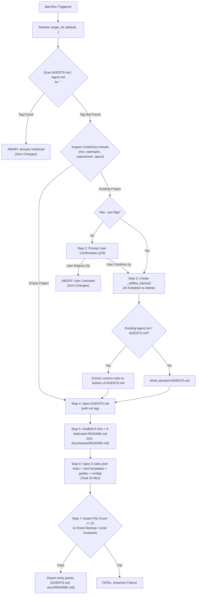

# ad-flow

Autonomous Agent Instruction Specification for Project Development Governance Bootstrap.

## 1. Objective & Single Responsibility

This skill has a single, dedicated purpose: **Bootstrap and land the structured, decoupled ad-flow engineering governance framework into the target codebase.**

- **Trigger**: User inputs `$ad-flow` (or `$ad-flow [target_dir]`).
- **No Subcommands**: Do NOT parse or expect subcommands (`init`, `new-card`, `archive` are retired from this skill). Invoking `$ad-flow` ALWAYS executes the governance bootstrap pipeline.
- **Strict Idempotency Guard**: Re-initialization is strictly prohibited. If `AGENTS.md` (or `Agent.md`) already contains `<!-- @ad-flow: initialized -->`, immediately terminate execution.

---

## 2. Machine Execution State Machine



---

## 3. Deterministic Pipeline Execution Protocol

When `$ad-flow` is received, the Agent MUST execute the steps below in exact sequence using native file inspection and editing tools (refer to `workflow.yaml`):

### Step 0: Idempotency Verification (Hard Termination Gate)
1. Read `${target_dir}/AGENTS.md`, `${target_dir}/Agent.md`, or `${target_dir}/agents.md` if any exists.
2. Check for the machine tag:
   ```text
   <!-- @ad-flow: initialized -->
   ```
3. If the tag is present:
   - **Action**: Immediately stop and output:
     > `Project already initialized with ad-flow governance (found <!-- @ad-flow: initialized --> in AGENTS.md). Re-initialization aborted to protect existing governance baseline.`
   - **Constraint**: Make ZERO file modifications.

### Step 1: Asset Survey & Classification
1. Scan `${target_dir}` for code indicators (`package.json`, `Cargo.toml`, `pyproject.toml`, `go.mod`, `pom.xml`, `Makefile`, `src/`, `lib/`, `app/`).
2. Scan for documentation indicators:
   - Standard doc folders: `docs/`, `doc/`
   - Framework/spec folders: `openspec/`, `openspecs/`, `.openspec/`, `superpower/`, `superpowers/`, `.superpower/`, `.superpowers/`, `specs/`, `spec/`, `specification/`, `architecture/`
   - Root documentation: `*.md`, `*.txt`, `SPEC.md`, `SPECS.md`
3. Classify workspace state into `EMPTY_PROJECT`, `ONGOING_CODE_ONLY`, or `ONGOING_CODE_AND_DOCS`.

### Step 2: Human Confirmation Gate
1. If state is not `EMPTY_PROJECT` and `--yes` is not present:
   - Ask user for confirmation:
     > `检测到当前项目处于【进行中】（已存在代码/文档资产）。接入 ad-flow 前将自动在 _adflow_backup/ 完整备份现有资产。是否确认初始化？[y/N]`
   - If user replies `n` / `N` / cancels: exit immediately with code 0 and zero file edits.

### Step 3: Isolation Snapshot Creation (`_adflow_backup/`)
1. Create directory `${target_dir}/_adflow_backup/`.
2. Write `${target_dir}/_adflow_backup/README.md` containing strict invariant notice.
   - **CRITICAL INVARIANT**: AI Agent is strictly forbidden from deleting, pruning, or modifying `_adflow_backup/`. Only human developers may delete it.
3. If documentation exists:
   - Recursively copy ALL discovered documentation directories (including `docs/`, `doc/`, `openspec/`, `superpower/`, `specs/`, etc.) and root markdown files into `${target_dir}/_adflow_backup/original_docs/` preserving directory structure.
4. If code only, generate initial analysis draft in `_adflow_backup/analyzed_drafts/`.

### Step 4: AGENTS.md Injection & Custom Rule Merging
1. Read `templates/AGENTS.md.tpl`.
2. Ensure top contains `<!-- @ad-flow: initialized -->`.
3. If the project had an existing `Agent.md` or `AGENTS.md`:
   - Extract its original custom rules.
   - Append under `## 项目自定义规则 (Project Custom Rules)` at the bottom of the template.
4. Write to `${target_dir}/AGENTS.md`.

### Step 5: Directory Matrix & Dedicated READMEs (9 Directories)
Scaffold the 9 standard directories and inject their respective dedicated `README.md` from `templates/`:
1. `docs/README.md` (from `templates/docs/README.md.tpl`)
2. `docs/assets/README.md` (from `templates/docs/assets/README.md.tpl` - dedicated static/media asset hub)
3. `docs/devel/README.md` (from `templates/docs/devel-README.md.tpl`)
4. `docs/devel/design/README.md` (from `templates/docs/design/README.md.tpl` - embeds 8-section design outline; NEVER create `01-系统设计方案.md`)
5. `docs/devel/change/README.md` (from `templates/docs/change/README.md.tpl`)
6. `docs/devel/task/README.md` (from `templates/docs/task/README.md.tpl`)
7. `docs/devel/todo/README.md` (from `templates/docs/todo/README.md.tpl`)
8. `docs/guide/README.md` (from `templates/docs/guide/README.md.tpl`)
9. `docs/archive/README.md` (from `templates/docs/archive-README.md.tpl`)

*All READMEs strictly follow the unified 4-chapter structure (`1. 简介`, `2. 索引`, `3. 规范`, `4. xxx`) and English metadata headers (`created`, `last-change`, `status`, optional `version`).*

### Step 6: Machine Routing Hubs, Templates & Configs (13 Files)
1. Top/Mid-level index routers:
   - `docs/index.json` (from `templates/docs/index.json.tpl`, includes `assets/` entry)
   - `docs/devel/index.json` (from `templates/docs/devel-index.json.tpl`)
   - `docs/guide/index.json` (from `templates/docs/guide/index.json.tpl`)
2. Change subsystem:
   - `docs/devel/change/index.json` (from `templates/docs/change/index.json.tpl`)
   - `docs/devel/change/template.json` (from `templates/docs/change/change-card.json.tpl`, includes `"branch": "fix/C[001~999]-[short-desc]"`)
3. Task subsystem:
   - `docs/devel/task/index.json` (from `templates/docs/task/index.json.tpl`)
   - `docs/devel/task/template.json` (from `templates/docs/task/task-card.json.tpl`, includes `"branch": "feat/T[01~99]-[short-desc]"`)
4. Todo zero-sediment buffers:
   - `docs/devel/todo/now.md` (from `templates/docs/todo/now.md.tpl`)
   - `docs/devel/todo/future.md` (from `templates/docs/todo/future.md.tpl`)
5. Guide baseline:
   - `docs/guide/01-本地部署指南.md` (from `templates/docs/guide/01-本地部署指南.md.tpl`)
6. Root files:
   - `CHANGELOG.md` (from `templates/docs/changelog.md.tpl`)
   - `adflow.config.json` (from `templates/adflow.config.json.tpl`)

### Step 7: DoD Assertions Verification & Report
1. Verify exactly 22 governance files exist.
2. Assert forbidden file `docs/devel/design/01-系统设计方案.md` does NOT exist.
3. Assert `_adflow_backup/` is intact (if created).
4. Assert `local/` is NOT modified or deleted by AI.
5. Report primary entry points (`AGENTS.md`, `docs/README.md`, `docs/devel/design/README.md`, `docs/guide/01-本地部署指南.md`) to the user.

---

## 4. Invariant Rules (Machine Hard Constraints)

- **INV_IDEMPOTENCY_GUARD**: If `AGENTS.md` contains `<!-- @ad-flow: initialized -->`, do NOT execute re-initialization.
- **INV_NO_AGENT_DELETE_BACKUP**: AI Agent must NEVER delete or alter `_adflow_backup/`.
- **INV_NO_AGENT_DELETE_LOCAL**: AI Agent must NEVER delete or reset `local/` or `local/deploy_report.md`.
- **INV_NO_FAKE_DESIGN_DOC**: Never generate a fake design specification `01-系统设计方案.md`. Design specifications must only be authored based on actual system architecture.
- **INV_TOTAL_OUTPUT_COUNT**: Exactly 22 standardized governance files must be created upon initialization.
