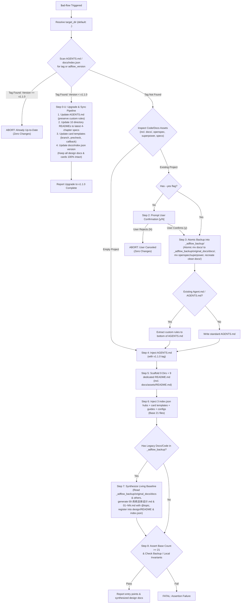

# ad-flow

Autonomous Agent Instruction Specification for Project Development Governance Bootstrap.

## 1. Objective & Single Responsibility

This skill has a single, dedicated purpose: **Bootstrap and land the structured, decoupled ad-flow engineering governance framework into the target codebase.**

- **Trigger**: User inputs `$ad-flow` (or `$ad-flow [target_dir]`).
- **No Subcommands**: Do NOT parse or expect subcommands (`init`, `new-card`, `archive` are retired from this skill). Invoking `$ad-flow` ALWAYS executes the bootstrap or upgrade pipeline.
- **Version-Aware Idempotency & Upgrade**: Checks for `<!-- @ad-flow: initialized vX.Y.Z -->` (or `"adflow_version"` in `docs/index.json`). If version matches skill version (`v1.1.0`), safely exits with zero changes. If version is older or updated rules are detected, triggers the **Upgrade & Specification Sync Pipeline** to update constitutions, README matrices, and card templates while 100% preserving user business designs and cards.

---

## 2. Machine Execution State Machine



---

## 3. Deterministic Pipeline Execution Protocol

When `$ad-flow` is received, the Agent MUST execute the steps below in exact sequence using native file inspection and editing tools (refer to `workflow.yaml`):

### Step 0: Idempotency & Version Upgrade Check (Smart Router)
1. Read `${target_dir}/AGENTS.md`, `${target_dir}/Agent.md`, or `${target_dir}/docs/index.json`.
2. Check for machine tag:
   ```text
   <!-- @ad-flow: initialized(?: v([0-9.]+))? -->
   ```
   or check `"adflow_version"` in `docs/index.json`. Current skill version is `v1.1.0`.
3. Decision Logic:
   - **If Version Matches `v1.1.0`** (and no `--force` flag):
     Immediately stop and output:
     > `Project is already up-to-date with ad-flow governance specification (v1.1.0). Zero changes made.`
   - **If Version is Older (e.g. v1.0.0 or unversioned)** OR user supplied `--force` / `--upgrade`:
     Output notification and **BRANCH TO Step 0-U (Upgrade & Sync Pipeline)**.
   - **If Tag Not Found**:
     Proceed to initial bootstrap (Step 1).

### Step 0-U: Governance Upgrade & Specification Sync Pipeline
*Executes when an existing ad-flow project is detected with an older version than current skill.*
1. Snapshot current governance files into `${target_dir}/_adflow_backup/upgrade_snapshot/`.
2. Update `${target_dir}/AGENTS.md`:
   - Refresh all core governance sections from `templates/AGENTS.md.tpl` (Code Style, Workflow, Local Build Packaging & Isolation, Testing Standards, Branching & Git conventions).
   - Set tag to: `<!-- @ad-flow: initialized v1.1.0 -->`.
   - **CRITICAL PRESERVATION INVARIANT**: Preserve all existing content under `## 项目自定义规则 (Project Custom Rules)` at the bottom of `AGENTS.md`.
3. Update 9 Directory `README.md` files:
   - Synchronize `docs/README.md`, `docs/assets/README.md`, `docs/devel/README.md`, `docs/devel/change/README.md`, `docs/devel/task/README.md`, `docs/devel/todo/README.md`, `docs/guide/README.md`, `docs/archive/README.md` to latest 4-chapter rules and metadata headers.
   - In `docs/devel/design/README.md`, update guidelines while **strictly preserving** existing registered module matrix rows.
4. Update Card Templates:
   - Refresh `docs/devel/change/template.json` and `docs/devel/task/template.json` with latest standard fields (`branch`, `precheck`, `callback`).
   - **NEVER modify or delete existing change cards (`C*.json`) or task cards (`T*.json`)**.
5. Update Configuration Version:
   - In `${target_dir}/docs/index.json`, set `"adflow_version": "1.1.0"`.
6. Strict Upgrade Invariants:
   - **NEVER touch or delete**: `docs/devel/design/*.md` (user's living baseline designs), existing `change/C*.json`, `task/T*.json`, `todo/now.md`, `todo/future.md`, or `local/`.
7. Report upgrade success to the user with summary of refreshed specifications. (Terminate execution).

### Step 1: Asset Survey & Classification
1. Scan `${target_dir}` for code indicators (`package.json`, `Cargo.toml`, `pyproject.toml`, `go.mod`, `pom.xml`, `Makefile`, `src/`, `lib/`, `app/`).
2. Scan for documentation indicators:
   - Standard doc folders: `docs/`, `doc/` (CRITICAL: flag if pre-existing `docs/` is present as `HAS_EXISTING_DOCS_DIR`).
   - Framework/spec folders: `openspec/`, `openspecs/`, `.openspec/`, `superpower/`, `superpowers/`, `.superpower/`, `.superpowers/`, `specs/`, `spec/`, `specification/`, `architecture/`.
   - Root documentation: `*.md`, `*.txt`, `SPEC.md`, `SPECS.md`.
3. Classify workspace state into `EMPTY_PROJECT`, `ONGOING_CODE_ONLY`, or `ONGOING_CODE_AND_DOCS`.

### Step 2: Human Confirmation Gate
1. If state is not `EMPTY_PROJECT` and `--yes` is not present:
   - Ask user for confirmation:
     > `检测到当前项目处于【进行中】（已存在代码/文档资产）。接入 ad-flow 前将自动在 _adflow_backup/ 完整备份现有资产。是否确认初始化？[y/N]`
   - If user replies `n` / `N` / cancels: exit immediately with code 0 and zero file edits.

### Step 3: Isolation Snapshot Creation (`_adflow_backup/`)
1. Create directory `${target_dir}/_adflow_backup/`.
2. Write `${target_dir}/_adflow_backup/README.md` containing strict invariant notice.
   - **CRITICAL INVARIANT**: AI Agent is strictly forbidden from deleting, pruning, or modifying `_adflow_backup/`. Only human developers may delete it.
3. Atomic Documentation Isolation & Backup:
   - **CRITICAL - Existing `docs/` Directory**: If `${target_dir}/docs` exists, AI Agent MUST execute atomic isolation:
     ```bash
     mkdir -p ${target_dir}/_adflow_backup/original_docs/
     mv ${target_dir}/docs ${target_dir}/_adflow_backup/original_docs/docs
     mkdir -p ${target_dir}/docs
     ```
     This completely isolates legacy documentation out of the root, preventing in-place overwriting and directory pollution.
   - **Framework Spec Folders**: If `doc/`, `openspec/`, `superpower/`, `specs/`, etc. exist, move them into `${target_dir}/_adflow_backup/original_docs/`.
   - **Root Markdown Files**: Copy/move all root documentation files into `${target_dir}/_adflow_backup/original_docs/root_markdowns/`.
4. If code only, generate initial analysis draft in `_adflow_backup/analyzed_drafts/`.

### Step 4: AGENTS.md Injection & Custom Rule Merging
1. Read `templates/AGENTS.md.tpl`.
2. Ensure top contains `<!-- @ad-flow: initialized v1.1.0 -->`.
3. If the project had an existing `Agent.md` or `AGENTS.md`:
   - Extract its original custom rules.
   - Append under `## 项目自定义规则 (Project Custom Rules)` at the bottom of the template.
4. Write to `${target_dir}/AGENTS.md`.

### Step 5: Directory Matrix & Dedicated READMEs (9 Directories)
Scaffold the 9 standard directories and inject their respective dedicated `README.md` from `templates/`:
1. `docs/README.md` (from `templates/docs/README.md.tpl`)
2. `docs/assets/README.md` (from `templates/docs/assets/README.md.tpl` - dedicated static/media asset hub)
3. `docs/devel/README.md` (from `templates/docs/devel-README.md.tpl`)
4. `docs/devel/design/README.md` (from `templates/docs/design/README.md.tpl` - embeds 8-section design outline; NEVER create `01-系统设计方案.md`)
5. `docs/devel/change/README.md` (from `templates/docs/change/README.md.tpl`)
6. `docs/devel/task/README.md` (from `templates/docs/task/README.md.tpl`)
7. `docs/devel/todo/README.md` (from `templates/docs/todo/README.md.tpl`)
8. `docs/devel/env/README.md` (from `templates/docs/env/README.md.tpl` - dedicated environment, cache inventory & cleanup hub)
9. `docs/guide/README.md` (from `templates/docs/guide/README.md.tpl`)
10. `docs/archive/README.md` (from `templates/docs/archive-README.md.tpl`)

*All READMEs strictly follow the unified 4-chapter structure (`1. 简介`, `2. 索引`, `3. 规范`, `4. xxx`) and English metadata headers (`created`, `last-change`, `status`, optional `version`).*

### Step 6: Machine Routing Hubs, Templates & Configs (14 Files)
1. Top/Mid-level index routers:
   - `docs/index.json` (from `templates/docs/index.json.tpl`, includes `assets/` entry)
   - `docs/devel/index.json` (from `templates/docs/devel-index.json.tpl`, includes `env` subsystem)
   - `docs/guide/index.json` (from `templates/docs/guide/index.json.tpl`)
2. Change subsystem:
   - `docs/devel/change/index.json` (from `templates/docs/change/index.json.tpl`)
   - `docs/devel/change/template.json` (from `templates/docs/change/change-card.json.tpl`, includes `"branch": "fix/C[001~999]-[short-desc]"`)
3. Task subsystem:
   - `docs/devel/task/index.json` (from `templates/docs/task/index.json.tpl`)
   - `docs/devel/task/template.json` (from `templates/docs/task/task-card.json.tpl`, includes `"branch": "feat/T[01~99]-[short-desc]"`)
4. Todo zero-sediment buffers:
   - `docs/devel/todo/now.md` (from `templates/docs/todo/now.md.tpl`)
   - `docs/devel/todo/future.md` (from `templates/docs/todo/future.md.tpl`)
5. Environment governance:
   - `docs/devel/env/01-环境缓存与依赖清理指南.md` (from `templates/docs/env/01-环境缓存与依赖清理指南.md.tpl`)
6. Guide baseline:
   - `docs/guide/01-本地部署指南.md` (from `templates/docs/guide/01-本地部署指南.md.tpl`)
7. Root files:
   - `CHANGELOG.md` (from `templates/docs/changelog.md.tpl`)

### Step 7: Synthesize Living Baseline from Legacy Docs & Source Code
*Condition: Only executes if `_adflow_backup/original_docs/` has files OR project contains source code.*
1. Deeply inspect all legacy documentation in `_adflow_backup/original_docs/` (openspec, superpower, specs, legacy docs/, markdown files) and explore existing source code.
2. Extract the overall system architecture, topology, and functional domain boundaries.
3. Synthesize and generate `docs/devel/design/00-系统总体设计.md`:
   - System high-level architecture, module breakdown, domain matrix, tech stack.
4. For each identified domain/module, synthesize `docs/devel/design/01~NN-[模块中文名].md`:
   - Enforce unified 4-chapter structure: `1. 简介`, `2. 索引`, `3. 规范`, `4. xxx` (integrating Goals/Non-Goals, Requirements, Architecture, Interfaces/Contracts, Changelog matrix).
   - Standard English metadata headers: `created`, `last-change`, `status`, `version`.
   - Mandatory concept anchor: `<!-- @topic: TopicName -->`.
   - Direct link to changelog hub: `[变更总账 (TopicName)](../change/index.json#TopicName)`.
5. Register all synthesized topics and documents into:
   - `docs/devel/design/README.md` (Update the 《方案清单索引（功能模块矩阵）》 table).
   - `docs/devel/index.json` (Register under the design section).

### Step 8: DoD Assertions Verification & Report
1. Verify at least 23 base governance files exist.
2. If legacy docs existed, assert `00-系统总体设计.md` and domain micro-designs (`01~NN.md`) are synthesized and registered.
3. Assert generic placeholder file `docs/devel/design/01-系统设计方案.md` does NOT exist.
4. Assert `_adflow_backup/` is intact (if created).
5. Assert `local/` (housing build artifacts `local/dist/`, test data, logs, and `local/deploy_report.md`) is NOT modified or deleted by AI.
6. Report primary entry points (`AGENTS.md`, `docs/README.md`, `docs/devel/design/README.md`, `docs/guide/01-本地部署指南.md`, `docs/devel/env/README.md`) and list all synthesized design documents to the user.

---

## 4. Invariant Rules (Machine Hard Constraints)

- **INV_VERSION_AWARE_UPGRADE_GUARD**: If `AGENTS.md` contains `<!-- @ad-flow: initialized vX.Y.Z -->`, re-initialization is blocked if version matches `v1.1.0`. If older or forced, automatically triggers Step 0-U (Upgrade & Sync Pipeline).
- **INV_NO_AGENT_DELETE_BACKUP**: AI Agent must NEVER delete or alter `_adflow_backup/`.
- **INV_NO_AGENT_DELETE_LOCAL**: AI Agent must NEVER delete or reset `local/` or `local/deploy_report.md`. All build outputs (dist/, build/) and runtime data are strictly quarantined in `local/`.
- **INV_EVIDENCE_BASED_DESIGN**: AI Agent is strictly forbidden from creating hollow placeholder design specs. When legacy docs exist in `_adflow_backup/original_docs/` or source code exists, Agent MUST synthesize and reconstruct Living Baseline design docs (00-系统总体设计.md, 01~NN.md) adhering to ad-flow 4-chapter and @topic standards.
- **INV_BASE_GOVERNANCE_COUNT**: At least 23 standardized base governance files must be created upon initialization, plus N reconstructed design documents if legacy docs/code exist.
- **INV_NO_README_AS_DESIGN_DOC**: AI Agent is strictly forbidden from setting `design_doc` or `doc` in any card (C/T) or index to any `README.md` (including `docs/devel/design/README.md`). It MUST point to a living baseline design doc (`00-系统总体设计.md` or `01~99-[module].md`) containing the matching `<!-- @topic: TopicName -->`. If missing, Agent must follow Doc First to supplement or create the design doc first.
