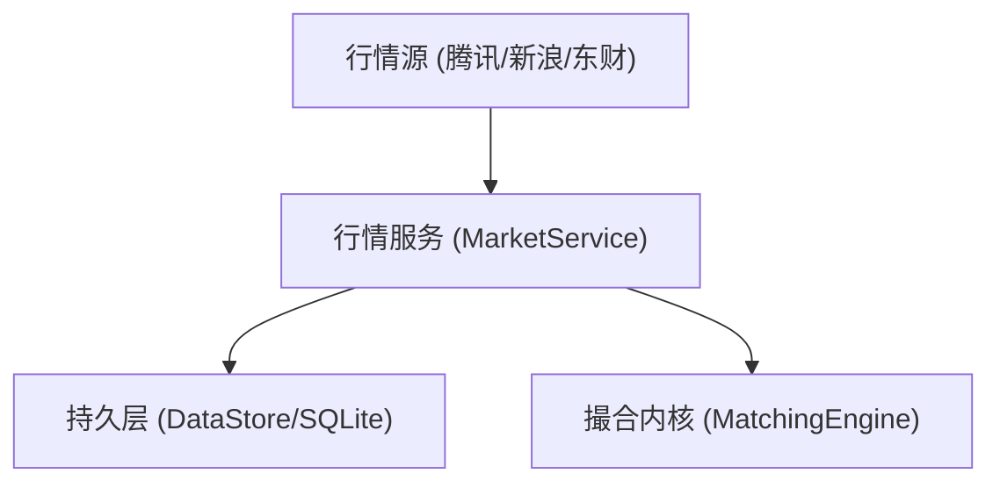

# 行情服务设计方案

> **文档ID**: DESIGN-MARKET ｜ **状态**: 现行基线 ｜ **最后更新**: 2026-09-20
> **所属总体**: [00-系统总体设计.md](00-系统总体设计.md) ｜ **对应 Topic**: `MarketService`

---

## 1. 简介与职责边界

行情服务负责多数据源的实时行情采集、快照清洗与落库。在后端全局分层架构中位于数据采集与接入层，为下游撮合引擎与前端控制台提供稳定的行情数据基座。

---

## 2. 核心业务规则与数据契约
<!-- @topic: MarketService -->

#### 变更演进索引
| 变更编号 | 类型 | 简介 | 规则演进 |
|---|---|---|---|
| [C001](../change/C001.json) | BugFix | 修复日K引导缺code | 启动引导历史日K由 6 元组改为 7 元组契约 |
| [C008](../change/C008.json) | Refactor | 扩充降级链 | 增加新浪/东财多级源兜底 |
| [C010](../change/C010.json) | BugFix | 修复腾讯源时间戳致单桶失真 | 时间戳统一归一为 HH:MM:SS，异常不落桶 |

#### 现行设计基线
1. **日K启动引导与全量拉取**：
   * 实例启动时，对自选股与关注标的集拉取全量历史日K；
   * 数据契约强制采用 7 元组格式：`(code, date, open, close, high, low, volume)`，由适配器层完成入库前清洗，保证标的代码不丢失；
2. **多源降级链**：
   * 行情轮询按优先级自动降级：`腾讯接口(HTTP/HTTPS) -> 新浪备用源 -> 东方财富 -> 历史锚点`；
3. **盘中分时与增量落库**：
   * 盘中按分钟桶聚合增量落盘，停机时触发终态刷盘，日切时统一收口；
   * 严格校验交易日历，未来日期守卫拦截非交易时段的伪日切轮询。

---

## 3. 接口契约说明

| 接口端点 / 数据表 | 职责说明 | 输入输出契约 |
|---|---|---|
| `GET /api/market/kline` | 查询标的多周期历史 K 线数据 | 入参 `code`, `period`；回执包含日K数据数组 |
| `GET /api/market/minute` | 查询标的当日盘中分时数据 | 入参 `code`；回执包含 242 根分钟级分时数据 |
